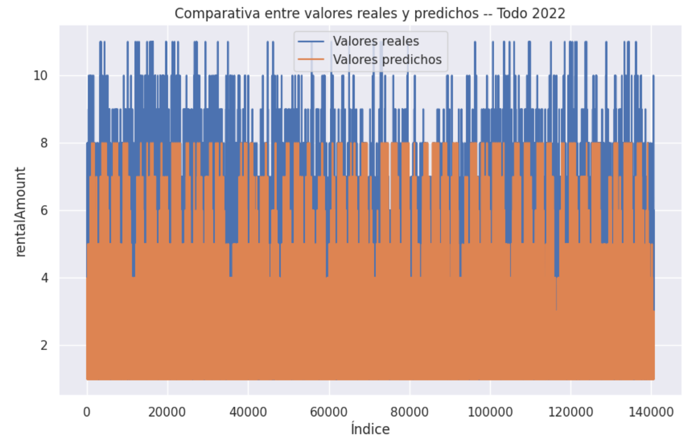

# Recursos disponibles
	[Código fuente](https://github.com/Ruben-Armas/AI_Models_and_Data_Processing/tree/8e0b2a10cf05641459b1fd6c1ca6895a79e05ce9/Trabajo_final_IA_BigData-Siticleta)
	[DataSets](https://github.com/Ruben-Armas/AI_Models_and_Data_Processing/tree/8e0b2a10cf05641459b1fd6c1ca6895a79e05ce9/DataSets/Sagulpa/S%C3%ADticleta)
	[API](https://github.com/Ruben-Armas/AI_Models_and_Data_Processing/tree/8e0b2a10cf05641459b1fd6c1ca6895a79e05ce9/Api)

# Introducción
A continuación se exponen los resultados obtenidos en el trabajo de fin de curso de la especialización en Intteligencia Artificial y Big Data 2022/23.

El propósito de este caso de uso es, utilizar modelos de Inteligencia Artificial para realizar una predicción del número de alquileres de bicicletas que se realizarán en una estación de alquiler, en un día, hora y clima determinado.

## Objetivos del proyecto
	- Aumentar el rendimiento del servicio de alquiler de bicicletas (Síticleta), gestionado por Sagulpa.
	- Mejorar la movilidad en las ciudades.
	- Dar una alternativa eficaz al medio de transporte privado individual.
	- Ayudar en la transición ecológica que están teniendo las ciudades.

# Datos
Las fuentes de datos utilizadas son:

	[Sagulpa](https://www.sagulpa.com/datos-abiertos). Datos abiertos de alquiler de bicicletas. 
	[TuTiempo.net](https://www.tutiempo.net/registros/gclp/1-diciembre-2019.html). Web de datos meteorológicos.
	A estas anteriores se suma la librería de Python [workalendar](https://github.com/workalendar/workalendar), con la cual se indica si el día es laboral o no.

La dimensionalidad de los datos ya tratados son:

	- Unas 12.000 filas cada mes.
	- Unas 140.000 filas por año.

## Reducción de características
Debido al problema que representa la conocida Maldición de la Dimensionalidad. La cual indica que para tener buenos resultados, la cantidad de datos debe crecer exponencialmente en función del número de características.

Con el fin de reducir este problema, y debido a la gran correlación que tienen entre sí.
Se han omitido las variables de temperatura, viento, humedad y presión.
Dejando como característica representativa de todas ellas a 'weatherConditions'(Despejado, nublado, etc)

# problemas encontrados
Una vez obtenidos los datos y haber sido tratados con [Power BI](https://powerbi.microsoft.com/es-es/desktop/).

Se han realizado diversas pruebas con varios modelos, pero he llegado a la conclusión de que los datos están demasiado desbalanceados para que den buenos resultados.

LLegando a haber casos en los que la cantidad de registros con 1, 2 o 3 alquileres totales en una hora, superan los 50.000 registros. Pero en cambio, la cantidad de registros con más de 11 alquileres, no llegan a los 20 registros.

## Solución propuesta
La solución propuesta en este caso para disminuir este problema, es seleccionar un único mes para entrenar en vez de todo el año.

En este caso, después de estudiar los diferentes meses, se ha seleccionado Febrero. Ya que está mejor balanceado que el resto.

Además de esto, se han eliminado alguno outliers, los registros en los que la cantidad de alquileres era muy dispar al resto.

# Resultados obtenidos
Los mejores resultados, los ofreció el modelo LGBMRegressor con ajuste de hiperparámetros.

Resultando con un 28% de presición con el mes de Febrero y un 15% con respecto a todo el año de 2022.

## Evaluación de Precisión y Predicción de Febrero
 

## Evaluación de Precisión y Predicción de todo 2022
 

# Conclusiones
Este primer acercamiento al caso de uso, ha servido para identificar problemas y ver lo complejo que es trabajar con conjuntos de datos muy grandes.

Ha servido como punto de partida, con varios puntos de mejora.

## Mejoras propuestas
	- Tratar los datos para generar registros en los que no se alquilen bicicletas, para poder identificar los momentos en los que la cantidad de alquileres deba ser 0.
	- Utilizar redes neuronales aplicando técnicas de busqueda de hiperparámetros.
	- Reducir más el problema de la Maldición de la Dimensionalidad, agrupando varias características en una que las englobe. Como tramos horarios, estaciones, etc.
	- Balancear los datos
		- Disminuyendo las clases mayoritarias (submuestreo)
		- Aumentando las clases minoritarias (sobremuestreo)
		- Combinación de ambas técnicas
		- Generación de datos sintéticos
